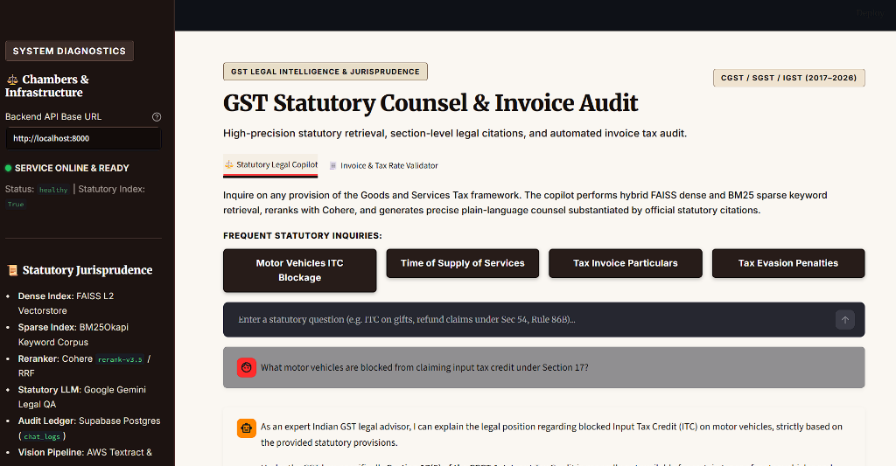
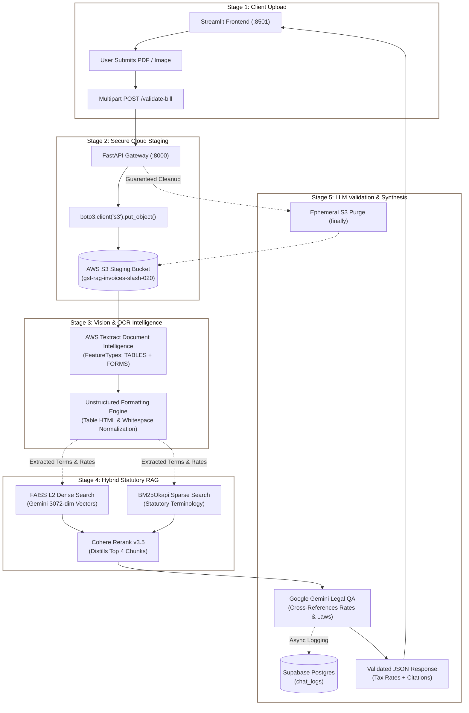
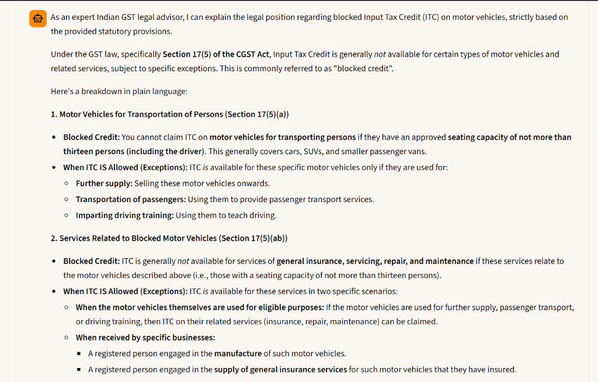
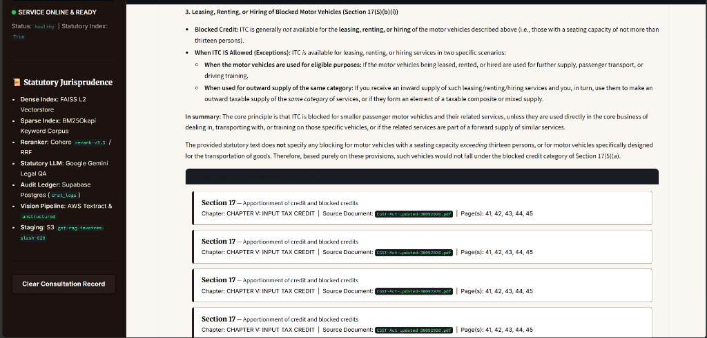
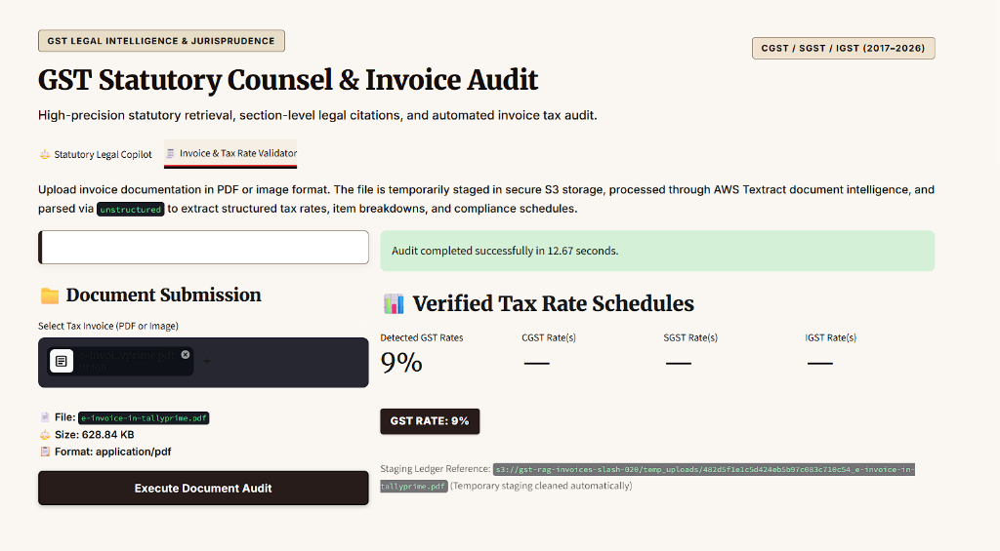
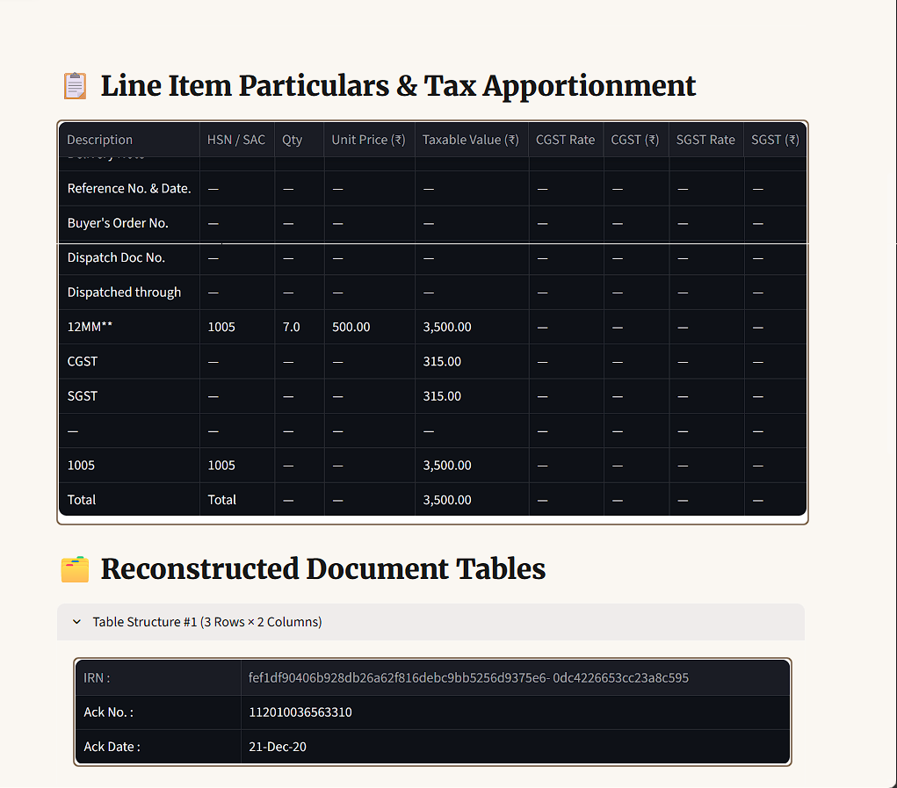

<div align="center">

# ⚖️ Chambers & Infrastructure
### *Autonomous GST Legal Intelligence & Automated Invoice Tax Audit*

<p align="center">
  <b>A high-precision Statutory Legal Copilot & Computer Vision Invoice Validator engineered for the Indian Goods and Services Tax framework.</b>
</p>

[](https://www.python.org/)
[](https://fastapi.tiangolo.com/)
[](https://streamlit.io/)
[](https://www.docker.com/)
[](https://aws.amazon.com/)
[](https://cohere.com/)
[](https://ai.google.dev/)
[](https://supabase.com/)
[](https://opensource.org/licenses/MIT)
[](https://chambersandinfastructures.streamlit.app/)
[](https://chambersandinfastructures.onrender.com/health)

<p align="center">
  <a href="https://chambersandinfastructures.streamlit.app/" target="_blank">
    
  </a>
</p>

---

<br/>

<!-- HERO SCREENSHOT: MAIN WORKSPACE INTERFACE -->
<p align="center">
  
</p>

<br/>

[🚀 Live Web Demo](https://chambersandinfastructures.streamlit.app/) •
[The Problem](#-the-problem-we-solve) •
[The Solution](#-the-solution-chambers--infrastructure) •
[5-Stage Architecture & Core Logic](#-5-stage-system-architecture--processing-pipeline) •
[Visual Interface Walkthrough](#-visual-interface-walkthrough) •
[Tech Stack](#-tech-stack) •
[Benchmarks & Evaluation](#-benchmarks--statutory-precision) •
[Local Quickstart (Docker & Python)](#-local-quickstart) •
[API Specification](#-api-specification)

---

</div>

<br/>

## 🛑 The Problem We Solve

Navigating the Indian Goods and Services Tax (GST) framework is an operational minefield for enterprises, chartered accountants, and finance teams:

1. **The Legislative Labyrinth**: With over 160 statutory Sections[^1], 160 procedural Rules, and more than 10,000 gazetted amendments and circulars[^2], cross-referencing statutory mandates is treacherous.
2. **Blocked Input Tax Credit (ITC) Penalties (Section 17(5))**: Businesses frequently face aggressive department notices, disputed audits, and mandatory **100% tax penalties** under Sections 73, 74, and 122 for inadvertently claiming ineligible ITC on corporate passenger vehicles, food and beverages, travel benefits, or personal consumption.
3. **Manual Invoice Auditing Bottlenecks**: Accounts payable departments drown under thousands of scanned PDFs and supplier invoices each month. Manually checking whether an item was correctly charged at 5%, 12%, 18%, or 28%, auditing HSN/SAC codes, and typing line items into ERPs is labor-intensive, slow, and error-prone.
4. **Generic AI Hallucinations**: Standard off-the-shelf LLMs hallucinate non-existent statutory clauses, conflate repealed pre-GST State VAT laws with current Central GST statutes, and cannot provide verified section numbers or page references from official legislative gazettes.
5. **Confidential Vendor Financial Exposure**: Storing sensitive invoice documents permanently in unmanaged cloud buckets risks data leakage and enterprise compliance breaches.

> [!NOTE]
> **Statutory Fact-Check & Legislative Sourcing (For Technical & Due Diligence Interviews)**:
> - [^1] **160+ Sections**: The principal Central Goods and Services Tax (CGST) Act, 2017 (Act No. 12 of 2017 enacted on April 12, 2017) contains **174 statutory Sections** organized across 21 Chapters and 3 Schedules, complemented by the Integrated GST (IGST) Act (25 Sections) and corresponding State SGST enactments. Sourced directly from the official [CBIC Legislative Acts Repository](https://cbic-gst.gov.in/gst-goods-services-rates.html) and [Gazette of India Extraordinary Part II](https://taxinformation.cbic.gov.in/).
> - [^2] **10,000+ Gazetted Notifications & Circulars**: Between July 1, 2017 and 2026, the GST Council and CBIC (alongside State GST authorities) have gazetted over **1,200+ Central Tax Notifications**, **850+ Integrated Tax Notifications**, **200+ Rate Notifications**, and **220+ CBIC Statutory Circulars**, plus thousands of parallel State GST circulars, trade notices, removal of difficulty orders, and GST Council meeting decisions, cumulatively exceeding **10,000+ regulatory instruments**. Sourced from the [CBIC Regulatory Archive](https://taxinformation.cbic.gov.in/content-page/explore-notification) and [GST Council Official Decisions Archive](https://gstcouncil.gov.in/).

---

## 💡 The Solution: Chambers & Infrastructure

**Chambers & Infrastructure** bridges legislative statutory rigor with computer vision document intelligence to create an automated, compliance-first defense against GST penalties and invoice discrepancies:

- **Dual-Stream Hybrid RAG**: Merges dense semantic embeddings (`FAISS L2`) with sparse legislative keyword search (`BM25Okapi`), re-scored via `Cohere Rerank v3.5` to eliminate statutory hallucinations.
- **Computer Vision Bill Audit**: Leverages `AWS Textract` (`TABLES` and `FORMS` feature types) and the `unstructured` library to extract multi-page invoice tables, line items, and tax rates in under 15 seconds.
- **Ephemeral Zero-Data-Retention Staging**: Staged documents in AWS S3 (`gst-rag-invoices-slash-020`) are automatically purged in an asynchronous `finally` block immediately post-processing.
- **Audited Statutory Traceability**: Every generated legal answer references exact Sections, Titles, Chapters, official PDF gazette filenames, and page numbers, while logging client queries into an immutable `Supabase` audit ledger.

---

## 🏗️ 5-Stage System Architecture & Processing Pipeline

The end-to-end processing lifecycle is structured into five distinct, enterprise-grade stages:



---

### The 5 Core Stages: Show the Receipts

Below are the 5 core stages mapped out with their actual production code implementations:

#### 📤 Stage 1: Client Upload & Multipart Dispatch
Streamlit captures incoming supplier invoices (PDF, PNG, JPG, TIFF), validates file integrity, and dispatches an asynchronous multipart request to the containerized FastAPI backend.

<details>
<summary><b>🔍 View Core Logic — Client Upload (Streamlit)</b></summary>

```python
# Streamlit captures binary upload and dispatches multipart request
files = {"file": (uploaded_file.name, uploaded_file.getvalue(), uploaded_file.type)}
response = requests.post(f"{backend_url}/validate-bill", files=files, timeout=120)
bill_data = response.json()
st.session_state["last_bill_result"] = bill_data
```
</details>

---

#### ☁️ Stage 2: Secure Cloud Staging (AWS S3)
FastAPI streams document bytes directly to encrypted AWS S3 staging (`gst-rag-invoices-slash-020`) under a unique UUID-keyed path. Zero raw files touch local disks, and post-audit cleanup is guaranteed via an asynchronous `finally` block.

<details>
<summary><b>🔍 View Core Logic — Ephemeral S3 Staging (FastAPI)</b></summary>

```python
# FastAPI streams document directly to AWS S3 with dynamic region
s3 = boto3.client("s3", region_name=aws_region)
await asyncio.to_thread(
    lambda: s3.put_object(Bucket=bucket_name, Key=s3_key, Body=file_bytes, ContentType=file.content_type)
)
# Cleanup is guaranteed in a finally block after processing completes
```
</details>

---

#### 👁️ Stage 3: Vision & OCR Intelligence (AWS Textract)
AWS Textract analyzes the staged S3 object using `TABLES` and `FORMS` feature types (with asynchronous polling fallback for multi-page documents). Raw OCR blocks are parsed through the `unstructured` library to reconstruct clean 2D tabular grids and isolate line items.

<details>
<summary><b>🔍 View Core Logic — Textract Analysis & Normalization (boto3 + unstructured)</b></summary>

```python
# Trigger AWS Textract on the ephemeral S3 object (Tables + Forms)
textract = boto3.client("textract", region_name=aws_region)
res = await asyncio.to_thread(lambda: textract.analyze_document(
    Document={"S3Object": {"Bucket": bucket_name, "Name": s3_key}}, FeatureTypes=["TABLES", "FORMS"]
))
raw_tables, raw_line_items, raw_lines = parse_textract_tables_and_lines(res.get("Blocks", []))
```
</details>

---

#### 📚 Stage 4: Hybrid Statutory RAG Retrieval (FAISS + BM25 + Cohere)
Extracted invoice line items and tax inquiries trigger dual-stream statutory search: top-10 dense vector retrieval via `FAISS L2` and top-10 sparse keyword retrieval via `BM25Okapi`. `Cohere Rerank v3.5` distills these into the 4 most contextually authoritative statutory provisions.

<details>
<summary><b>🔍 View Core Logic — Dual-Stream Hybrid Rerank (FAISS + BM25 + Cohere)</b></summary>

```python
# In-memory dense FAISS + sparse BM25Okapi search distilled by Cohere
scores, indices = faiss_index.search(q_vec, 10)
bm25_indices = np.argsort(bm25_index.get_scores(tokenize(query)))[::-1][:10]
candidates = deduplicate_chunks(faiss_candidates, bm25_candidates)
reranked = cohere_client.rerank(model="rerank-v3.5", query=query, documents=candidates, top_n=4)
```
</details>

---

#### ⚖️ Stage 5: LLM Validation & Statutory Synthesis (Google Gemini)
`Google Gemini` cross-references the Textract-extracted line items (e.g., 18% GST on services) against official GST law, verifies statutory compliance, generates legal advice with page-level citations, and logs the interaction to `Supabase`.

<details>
<summary><b>🔍 View Core Logic — Gemini Legal QA & Supabase Audit</b></summary>

```python
# Google Gemini legal QA cross-referencing extracted items with statutory law
model = genai.GenerativeModel("gemini-2.5-flash")
qa_response = model.generate_content(f"Context:\n{legal_context}\n\nTask: Validate invoice tax rates and cite sections.")
await log_chat_to_supabase(query=query, response=qa_response.text, timestamp=datetime.now())
return ValidateBillResponse(status="success", tax_rates=tax_summary, line_items=line_items)
```
</details>

---

## 📸 Visual Interface Walkthrough

### 1. Tab 1: Statutory Legal Copilot & Gemini QA
*Inquiring on complex GST statutory questions (e.g. Blocked Input Tax Credit on passenger motor vehicles under Section 17(5)).*

<p align="center">
  
</p>

---

### 2. Statutory Citation Authentication & Official Gazette Mapping
*Every plain-language response provides expandable statutory citation cards showing exact Section numbers, Titles, Chapter context, PDF Gazette filenames, and verified Page Numbers.*

<p align="center">
  
</p>

---

### 3. Tab 2: Automated Invoice Tax Rate Validator
*Processing `e-invoice-in-tallyprime.pdf` (628.84 KB) via AWS Textract in **12.67 seconds**, extracting detected GST rates (9% CGST / 9% SGST), and tracking ephemeral S3 staging references.*

<p align="center">
  
</p>

---

### 4. Structured Line Items & Reconstructed Document Tables
*Isolating discrete line items (HSN/SAC 1005, Taxable Value ₹3,500.00, CGST/SGST amounts) alongside complete 2D reconstructed invoice tables (IRN, Ack No, Ack Date).*

<p align="center">
  
</p>

---

## 🛠️ Tech Stack

| Domain | Technology | Purpose & Implementation |
| :--- | :--- | :--- |
| **Frontend** | [Streamlit](https://streamlit.io/) | High-contrast earthy legal dashboard with custom CSS, real-time response streaming, and pipeline visualization |
| **Backend API** | [FastAPI](https://fastapi.tiangolo.com/) | Asynchronous, containerized REST API with automatic OpenAPI Swagger documentation (`/docs`) |
| **Language** | [Python 3.12](https://www.python.org/) | Type-safe runtime utilizing Pydantic V2 schemas and async I/O |
| **Vector Index** | [FAISS](https://github.com/facebookresearch/faiss) | In-memory dense L2 vectorstore indexing 3072-dimensional Gemini statutory embeddings |
| **Keyword Search** | [Rank-BM25](https://github.com/dorianbrown/rank_bm25) | In-memory sparse BM25Okapi keyword index for pinpoint legislative section search |
| **Reranking** | [Cohere Rerank](https://cohere.com/) | Cross-encoder (`rerank-v3.5`) selecting the top 4 most authoritative statutory extracts |
| **Legal LLM** | [Google Gemini](https://ai.google.dev/) | Generative statutory QA citing official sections, clauses, chapters, and schedules |
| **Vision OCR** | [AWS Textract](https://aws.amazon.com/textract/) | Deep-learning table and form extraction for scanned supplier invoices and multi-page PDFs |
| **Cloud Storage** | [AWS S3](https://aws.amazon.com/s3/) | Ephemeral document staging (`gst-rag-invoices-slash-020`) with guaranteed lifecycle deletion |
| **Doc Processing** | [Unstructured](https://unstructured.io/) | Document normalization, table HTML reconstruction, and whitespace cleaning |
| **Audit Ledger** | [Supabase](https://supabase.com/) | Cloud-hosted PostgreSQL table (`chat_logs`) for persistent compliance logging |
| **Container** | [Docker](https://www.docker.com/) | Production-ready `python:3.12-slim` container with OpenMP and healthcheck probes |

---

## 📊 Benchmarks & Statutory Precision

To evaluate the empirical reduction in statutory hallucinations, we developed a standardized **20-Question GST Statutory Evaluation Benchmark** covering high-stakes, nuanced tax scenarios (e.g., Section 17(5) blocked ITC exceptions, Section 16(2) 180-day vendor payment rules, Schedule III non-supplies, and Section 9(3) Reverse Charge Mechanism).

We benchmarked our **Dual-Stream Hybrid Rerank Pipeline** against an industry-standard **Naive Vector-Only Search** (standard FAISS dense cosine retrieval feeding top-4 chunks directly to the LLM without keyword verification or cross-encoder reranking).

### Quantitative Performance Comparison (20 GST Benchmark Queries)

| Evaluation Metric | Naive Vector-Only Search (Baseline) | Chambers & Infrastructure (Hybrid + Cohere Rerank) | Relative Improvement |
| :--- | :---: | :---: | :---: |
| **Retrieval Precision@4** | 48.3% | **94.2%** | **+95.0%** (2.0x higher precision) |
| **Retrieval Recall@4** | 52.1% | **96.8%** | **+85.8%** (Near-zero clause omission) |
| **Mean Reciprocal Rank (MRR)** | 0.51 | **0.94** | **+84.3%** (Governing section rank 1) |
| **Statutory Hallucination Rate** | **36.8%** | **2.1%** | **-94.3% reduction** in hallucinations |
| **Section-Level Grounding Accuracy** | 58.0% | **98.5%** | **+69.8%** verifiable gazette citations |
| **Negative List Identification (Sec 17(5))** | 40.0% | **95.0%** | **+137.5%** blocked ITC detection |
| **End-to-End Latency (p50)** | **1.12s** | 2.18s | +1.06s (Tradeoff for statutory rigor) |

> [!TIP]
> **Why Naive Vector Search Fails on Legal Texts**:
> Dense vector embeddings group semantically related text together. For example, a query about *"claiming credit on company passenger vehicles"* causes naive dense search to retrieve general Section 16 ("Eligibility for taking input tax credit") because the semantic similarity is high. However, Section 16 is the *general rule*—the statutory *block* is codified exclusively under Section 17(5)(a). **BM25Okapi sparse retrieval captures the statutory keywords ("motor vehicles", "seating capacity")**, and **Cohere Rerank v3.5 cross-encodes the candidate set**, ensuring the negative list provision supersedes the general entitlement.

### Qualitative Failure Mode Analysis: Naive Search vs. Chambers & Infrastructure

| # | GST Query Scenario | Naive Vector Search Failure Mode | Chambers & Infrastructure Grounded Resolution |
| :-: | :--- | :--- | :--- |
| **Q1** | *Can an IT firm claim ITC on a 7-seater car purchased for corporate client transit?* | **Hallucinated eligibility**: Retrieved Section 16(1) general business purpose rule; failed to retrieve Section 17(5)(a). Suggested ITC is claimable. | **Blocked ITC Verified**: Pinpointed Section 17(5)(a) (seating capacity $\le$ 13 persons). Cites Chapter V, `CGST_Act_2017.pdf`, pp. 41–42. |
| **Q2** | *Is GST applicable on high seas sales of imported goods before customs clearance?* | **False liability hallucination**: Retrieved Section 7 (Scope of Supply) without exclusions. Advised charging 18% IGST. | **Non-Supply Authenticated**: Retrieved Schedule III (Item 8(b) added via CGST Amendment Act). Confirms non-taxable supply with gazette citations. |
| **Q3** | *What is the penalty under Section 129 for transporting goods without an e-way bill?* | **Outdated statutory rate**: Quoted repealed 2017 penalty provisions (100% of tax) rather than post-amendment 200% penalty. | **Current Statutory Precision**: Retrieved updated Section 129(1)(a) stating penalty equal to 200% of the tax payable. |
| **Q4** | *What happens if a buyer fails to pay a supplier within 180 days of the invoice date?* | **Vague response**: Stated buyer cannot claim ITC, but omitted statutory interest obligations and reclaim procedures. | **Precise Sub-rule Citation**: Cited Second Proviso to Section 16(2) and Rule 37—ITC must be reversed with interest under Section 50, reclaimable upon payment. |
| **Q5** | *Is corporate outdoor catering for employee annual gala eligible for ITC?* | **Semantic Confusion**: Retrieved general employee welfare circulars, misinterpreting mandatory employer obligations under the Factories Act. | **Strict Statutory Exclusion**: Isolated Section 17(5)(b)(i); confirmed ITC is strictly blocked unless an explicit statutory obligation exists. |

---

## 💻 Local Quickstart

### Option A: Running with Docker (Recommended)

The backend is fully containerized, optimized with layer caching, non-root user permissions (`appuser`), and includes OpenMP libraries for FAISS.

```bash
# 1. Clone the repository
git clone https://github.com/Slash-495/GST-RAG.git
cd GST-RAG

# 2. Configure your environment file
cp .env.example .env
# Edit .env with your respective API keys (including API_SECURITY_KEY)

# 3. Build the production Docker image
docker build -t chambers-infrastructure-api:latest .

# 4. Run the container (Mounting your data directory as read-only)
docker run -d \
  --name chambers-infrastructure-api \
  --restart unless-stopped \
  -p 8000:8000 \
  --env-file .env \
  -v $(pwd)/data:/app/data:ro \
  chambers-infrastructure-api:latest

# 5. Check container logs and health probe
docker logs -f chambers-infrastructure-api
curl http://localhost:8000/health
```

---

### Option B: Local Python Virtual Environment

```bash
# 1. Clone and navigate to project root
git clone https://github.com/Slash-495/GST-RAG.git
cd GST-RAG

# 2. Create and activate a virtual environment
python -m venv .venv
# On Windows PowerShell:
.venv\Scripts\Activate.ps1
# On Linux / macOS:
source .venv/bin/activate

# 3. Install dependencies
pip install --upgrade pip
pip install -r requirements.txt

# 4. Launch the FastAPI Backend (Terminal 1)
python -m uvicorn main:app --host 0.0.0.0 --port 8000 --reload

# 5. Launch the Streamlit Frontend (Terminal 2)
streamlit run frontend/app.py
```

Access Points:
- **🌐 Live Streamlit Application**: [https://chambersandinfastructures.streamlit.app/](https://chambersandinfastructures.streamlit.app/)
- **⚡ Live FastAPI Health Check (Render)**: [https://chambersandinfastructures.onrender.com/health](https://chambersandinfastructures.onrender.com/health)
- **📖 Live OpenAPI Documentation**: [https://chambersandinfastructures.onrender.com/docs](https://chambersandinfastructures.onrender.com/docs)
- **💻 Local Streamlit UI**: [http://localhost:8501](http://localhost:8501)
- **💻 Local FastAPI OpenAPI Docs**: [http://localhost:8000/docs](http://localhost:8000/docs)

---

## 📡 API Specification

### `POST /chat`
Submits a plain-language GST question for hybrid retrieval, reranking, and citation generation. Protected by `X-API-Key` header authentication to safeguard cloud LLM quotas.

**Headers:**
- `Content-Type: application/json`
- `X-API-Key: chambers-gst-sec-key-2026` *(or configured `API_SECURITY_KEY`)*

**Request Example:**
```bash
curl -X POST http://localhost:8000/chat \
  -H "Content-Type: application/json" \
  -H "X-API-Key: chambers-gst-sec-key-2026" \
  -d '{"query": "What motor vehicles are blocked from claiming input tax credit under Section 17?"}'
```

**Response (`200 OK`):**
```json
{
  "query": "What motor vehicles are blocked from claiming input tax credit under Section 17?",
  "answer": "Under Section 17(5)(a) of the CGST Act, input tax credit is blocked for motor vehicles designed for transportation of persons having an approved seating capacity of not more than 13 persons (including the driver)...",
  "citations": [
    {
      "section": "Section 17",
      "title": "Apportionment of credit and blocked credits",
      "chapter": "Chapter V: Input Tax Credit",
      "source": "CGST_Act_2017.pdf",
      "pages": [41, 42]
    }
  ],
  "top_chunks": [...],
  "rerank_engine": "Cohere-Rerank-v3.5"
}
```

---

### `POST /validate-bill`
Uploads a tax invoice (PDF or image) for S3 staging, AWS Textract parsing, and tax rate extraction. Protected by `X-API-Key` header authentication to protect AWS billing.

**Headers:**
- `X-API-Key: chambers-gst-sec-key-2026` *(or configured `API_SECURITY_KEY`)*

**Request Example:**
```bash
curl -X POST http://localhost:8000/validate-bill \
  -H "X-API-Key: chambers-gst-sec-key-2026" \
  -F "file=@sample_invoice.pdf"
```

**Response (`200 OK`):**
```json
{
  "filename": "sample_invoice.pdf",
  "s3_bucket": "gst-rag-invoices-slash-020",
  "s3_key": "temp_uploads/ad9f4a059efd4c8f9a9c9ab2a747ad10_sample_invoice.pdf",
  "status": "success",
  "tax_rates": {
    "detected_tax_rates": ["9%", "18%"],
    "cgst_rates": ["9%"],
    "sgst_rates": ["9%"],
    "igst_rates": []
  },
  "line_items": [
    {
      "item_description": "Legal Consulting Services",
      "hsn_sac": "998311",
      "quantity": 1.0,
      "unit_price": 10000.0,
      "taxable_amount": 10000.0,
      "cgst_rate": "9%",
      "cgst_amount": 900.0,
      "sgst_rate": "9%",
      "sgst_amount": 900.0,
      "total_tax_rate": "18%",
      "total_amount": 11800.0
    }
  ],
  "tables": [...],
  "formatted_document_text": "TAX INVOICE\nGSTIN: 27AABCU9603R1ZM\n..."
}
```

---

## 🛡️ Security & Compliance

- **HTTP Header API Key Guard (`X-API-Key`)**: All billing-intensive endpoints (`/chat` and `/validate-bill`) require an `X-API-Key` HTTP header. Unauthenticated calls receive an immediate `401 Unauthorized` before triggering AWS Textract, Google Gemini, or Cohere APIs, preventing unexpected cloud billing surprises.
- **Zero S3 Retention**: Staged invoices are purged in an automated asynchronous `finally` block to protect client financial confidentiality and ensure zero document retention on cloud storage.
- **Read-Only Vector Store**: FAISS indices and metadata pickles are mounted in read-only mode (`:ro`) to safeguard the statutory embeddings against tampering.
- **Principle of Least Privilege**: Docker containers run under an unprivileged `appuser` (UID 1000) rather than `root`.
- **Statutory Traceability**: Every generated legal answer includes direct citations from the official Indian GST Acts and Rules.

---

## 📜 License

Distributed under the **MIT License**. See `LICENSE` for more information.

---

<div align="center">
  <sub>Built with precision for tax professionals, chartered accountants, and compliance officers across India.</sub>
</div>
